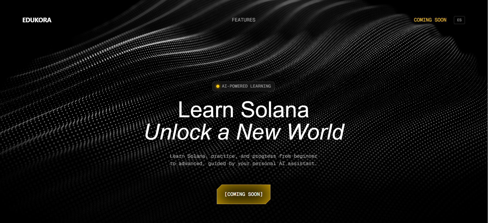
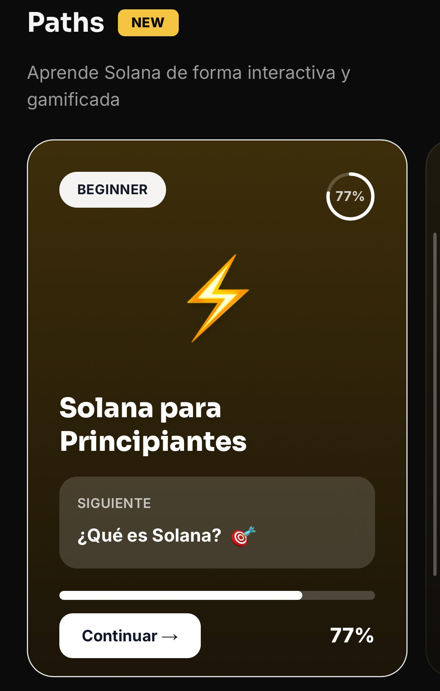
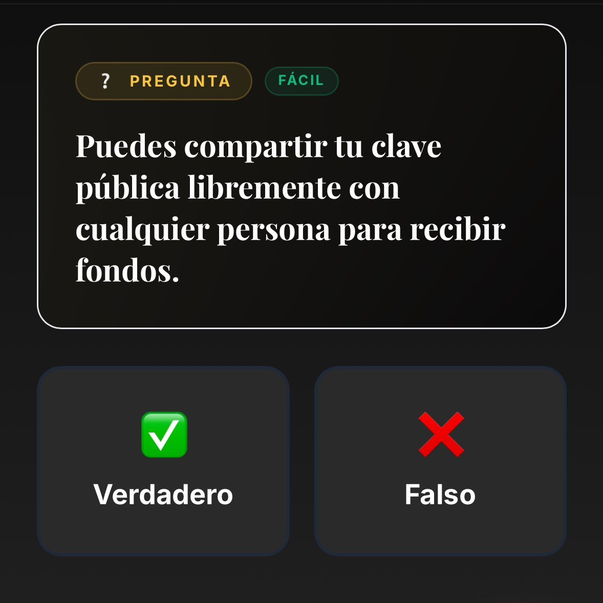
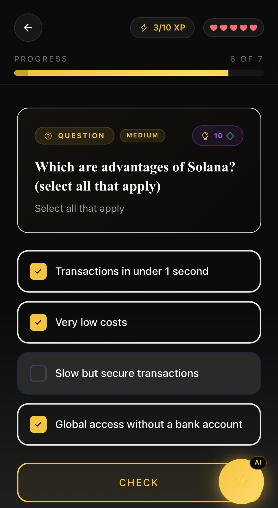
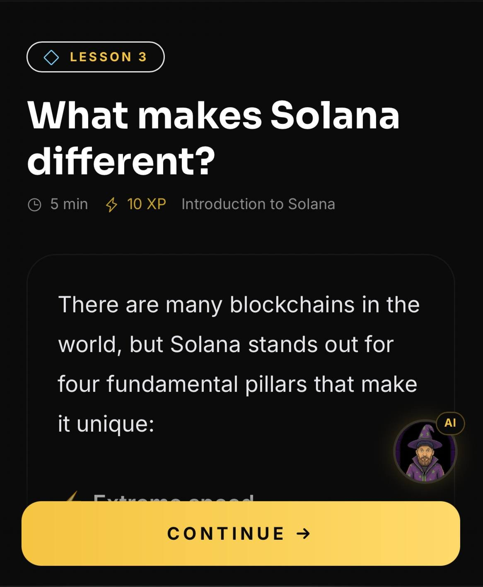
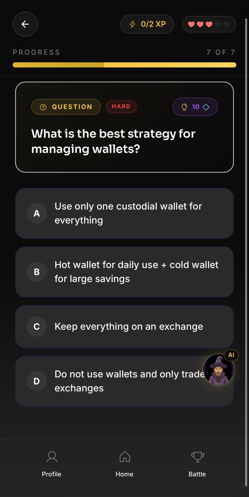

# EduKora

**Edukora** is a gamified learning platform designed to help people understand Solana and practice real onchain actions through guided learning paths and interactive challenges.

Our goal is simple:  
Make blockchain education practical, accessible, and engaging.

---

## The Problem

Blockchain education is still difficult for most people.

New users often face the same barriers:

- Installing a wallet feels intimidating
- Seed phrases and security are poorly explained
- The difference between networks (mainnet, testnet) is confusing
- Educational content is fragmented
- Many people learn theory but never practice real onchain actions

As a result, millions of curious users never move from **interest → participation**.

---

## The Solution

**Edukora** turns blockchain onboarding into a structured and gamified learning journey.

Instead of reading endless tutorials, users follow **guided learning routes** where each concept is explained simply and reinforced with practical exercises.

Core principles:

- Learn by doing
- Simplify complex concepts
- Encourage safe onchain interaction
- Turn learning into a motivating experience

---

## What Users Can Learn

Edukora focuses on practical blockchain literacy.

Examples of learning modules include:

- What is Solana
- How wallets work
- Seed phrase security
- Understanding transactions
- Connecting wallets to dApps
- Basic DeFi concepts
- Real-world blockchain use cases

Each learning path gradually introduces new actions and concepts.

---

## Gamified Learning Experience

To keep users engaged, EduKora integrates a progression system inspired by modern learning platforms.

Features include:

- XP progression
- Learning milestones
- Badges and achievements
- Guided learning routes
- Practical blockchain exercises

The goal is to make blockchain onboarding **engaging instead of overwhelming**.

---

## Bags Hackathon

Edukora is participating in the **Bags $100K Challenge**.

We are exploring ways to connect learning progress with crypto-native incentives.

Potential directions include:

- Rewarding meaningful learning milestones
- Turning educational progress into onchain participation
- Creating incentive systems around useful onboarding
- Encouraging real interaction with blockchain tools

The objective is not speculation, but **real education through action**.

---

## Project Status

Edukora is currently under active development.

Current stage:

- Core product architecture in progress
- Learning paths being structured
- Private beta testers reviewing the experience
- Public release coming soon

This repository serves as the **public documentation and showcase** for the project while development continues privately.

---

## Roadmap

### Phase 1 — Foundation
- Brand and platform concept
- Solana beginner learning route
- Wallet onboarding structure
- Early gamification mechanics

### Phase 2 — Interactive Learning
- Practical blockchain exercises
- XP and milestone system
- Guided onchain actions

### Phase 3 — Expansion
- Additional learning paths
- Community features
- Broader onboarding ecosystem

---

## Preview

## Website

https://edukora.xyz

---

## About the Builder

Edukora is created by **Maikol**, a community builder focused on making blockchain education accessible to Spanish-speaking users and global audiences.

The project is part of a broader effort to improve blockchain onboarding and empower new builders, users, creators, etc.

---

## Repository Purpose

This repository exists to:

- Document the vision and architecture of Edukora
- Share project information publicly
- Support hackathon submissions
- Provide transparency around development direction
